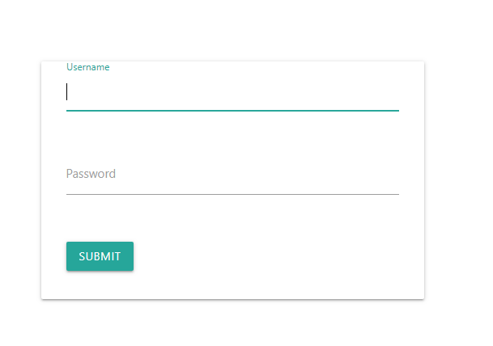
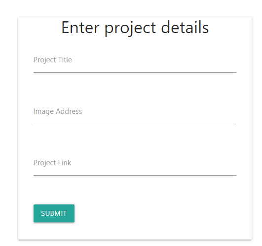

# Portfolio - Indima Dias

Repository for Portfolio page for Indima Dias

### Web Page
https://indimadias.github.io/

### Introduction 

This site presents my portfolo as a web application developer. It contains my contact details, my resume and project done so far

### Techonologies
    * HTML 
    * CSS
    * JavaScript
    * Jquery
    * Materialize framework
    * Firebase database

### Componets 

**Main Index**
        This is a one page Portfolio. User can browse through the page to view my story, contact details and links to my projects 
        Menu button allows easy access to other components of the page.

**Admin Page**
        This page is for the purpose of managing projects. It has a login form where the user name and password will be validate. 
        An authorized user can add new project details to this page. The records will be saved in a firebase database
        My Portfolio section access these records to pupulate porject information to the page

https://indimadias.github.io/admin

        Admin Login form

        Project details entering form 

